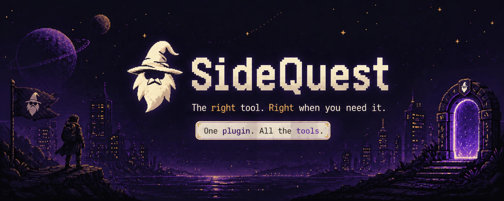
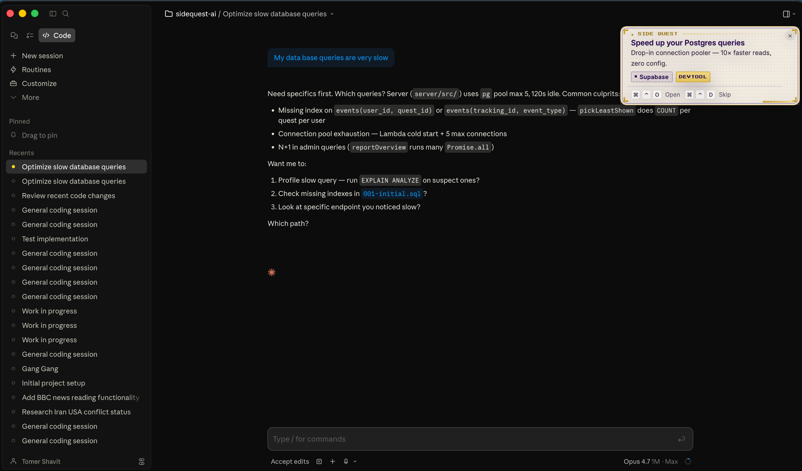

<picture>
  
</picture>

<h1 align="center">Contextual dev-tool discovery for Claude Code</h1>

<p align="center">
  <a href="#install">Install</a> ·
  <a href="#quests">Quests</a> ·
  <a href="#privacy">Privacy</a> ·
  <a href="BUILD.md">Verify Build</a> ·
  <a href="https://github.com/tomer-shavit/sidequest/issues">Issues</a>
</p>

<p align="center">
  
  
  
</p>

---

## Install

```bash
curl -fsSL https://get.trysidequest.ai/install.sh | bash
```

Installs the plugin into Claude Code, downloads the native macOS notification app, and runs Google OAuth (browser opens). macOS 13+ required.

That's it. Quests appear when context says they're useful.

> **Want to read the script before running it?** `curl https://get.trysidequest.ai/install.sh` (without piping to bash) prints the source. The same script also lives at [`scripts/install.sh`](scripts/install.sh) in this repo for GitHub-side audit.
>
> **Verify the bytes match the repo copy:**
>
> ```bash
> curl -fsSL https://get.trysidequest.ai/install.sh | shasum -a 256
> # Expect: dae4b81a9339b6bc24f1a65dbd23d92037b8fdf70af48af3863a3347761c7d0a
> ```
>
> Hash above is for the current `scripts/install.sh` at HEAD on `main`. For a release-pinned check, compare against `git show plugin-vX.Y.Z:scripts/install.sh | shasum -a 256`.

---

<p align="center">
  
</p>
<p align="center"><sub>A quest fires in the corner of Claude Code Desktop. Native, dismissable, capped at 5/day.</sub></p>

## Why SideQuest

- **Right tool, right moment.** While you're debugging Postgres, get a pointer to a faster connection pooler. Not a feed. Not a newsletter. A timed nudge inside the editor where you already are.
- **Native, not LLM-mediated.** Quests render through a real macOS notification card via the SideQuest app — 100% delivery. Doesn't depend on Claude choosing to surface anything.
- **Privacy by design.** Conversation content never leaves your machine. Only anonymous tag IDs travel — see [Privacy](#privacy).
- **Cap-respected.** Max 5/day. 20-minute cooldown. One ⌘⌃D dismiss permanently mutes. Do-Not-Disturb is one slash command away.
- **Open + audit-ready.** MIT. Reproducible plugin tarballs. Source-pinned binaries. See [BUILD.md](BUILD.md) to verify.

## Quests

Skills available inside Claude Code:

| Skill | What it does |
|---|---|
| `/sidequest:sq-login` | Sign in with Google. One-time. |
| `/sidequest:sq-status` | Health check — auth, app, API, timing. Run first when stuck. |
| `/sidequest:sq-settings` | Toggle the plugin on or off. |
| `/sidequest:sq-do-not-disturb` | Pause quests for 2 hours. |
| `/sidequest:sq-retrigger` | Re-show the last quest. |
| `/sidequest:sq-feedback` | Send feedback. |
| `/sidequest:sq-reinstall` | Pull the latest plugin + app. |
| `/sidequest:sq-uninstall` | Remove everything. |

## Privacy

**What stays on your machine:**
- Conversation content (Claude messages, prompts, code)
- Project files, repo contents, file paths
- Anything Claude reads or writes

**What we send to the API (only when a quest fires):**
- Anonymous user ID (UUID, not your email)
- Anonymous session/tracking ID (UUID per quest)
- Anonymous tag IDs (e.g. `tag_4791` — never the source string)
- Quest engagement: shown / clicked / dismissed
- Plugin + app version (for compatibility checks)

**Storage on your machine:**
- `~/.sidequest/config.json` — auth token, settings
- `~/.sidequest/timing-state.json` — quest cap state
- `~/.sidequest/tech-context.json` — anonymized tag IDs
- `~/.sidequest/sidequest.sock` — Unix socket (plugin ↔ app)

**Code paths to inspect:**
- Outbound network calls: [`plugin/hooks/stop-hook`](plugin/hooks/stop-hook) (line 361)
- Unix socket setup: [`plugin/hooks/stop-hook`](plugin/hooks/stop-hook) (line 324)
- Tag anonymization: [`plugin/hooks/extract-context.py`](plugin/hooks/extract-context.py) (line 58)

## How it works

**Plugin** (Claude Code hook). Runs as a stop-hook + session-start hook. Extracts local tag IDs from your project context. Calls the API for the least-shown matching quest. Sends the chosen quest to the native app over a Unix socket. Source: [`plugin/hooks/`](plugin/hooks/).

**Native app** (macOS). Listens on the Unix socket. Renders each quest as a macOS-native floating card, top-right. Handles open/skip keyboard. Auto-launches at login via SMAppService. Source: [`macOS/`](macOS/).

**API** (Lambda + Postgres). Receives `(user_id, tag_ids[])`. Returns one quest. Tracks shown/clicked/dismissed events. **Never receives prompt content.** Source: not in this repo (see `tomer-shavit/sidequest-ai` if you have access).

## Updates + uninstall

Updates are silent. The session-start hook compares your installed plugin/app version against the latest published version and pulls the new tarball/DMG when they differ.

To remove everything:

```bash
curl -fsSL https://get.trysidequest.ai/uninstall.sh | bash
```

Or, in Claude Code:

```
/sidequest:sq-uninstall
```

## Verify the build

This repo publishes deterministic plugin tarballs and source-pinned macOS DMGs. Anyone can clone at a release tag, rebuild, and confirm the SHA256 matches the asset on GitHub Releases. See [BUILD.md](BUILD.md) for the step-by-step verification guide.

## Support

- Run `/sidequest:sq-status` for a self-diagnosis.
- Open an [issue](https://github.com/tomer-shavit/sidequest/issues) for bugs or feature requests.
- Email [tomer.shavit5@gmail.com](mailto:tomer.shavit5@gmail.com) for security disclosures (also see [SECURITY.md](SECURITY.md)).

## License

MIT — see [LICENSE](LICENSE).
